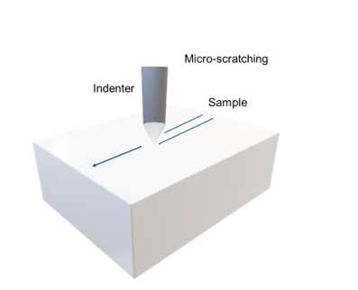

<b>Micro-scratching and wear of materials : </b>   

Scratching experiments can be performed using scratch testing equipment and tribometer systems. The key parameters involved is the load applied during the tests.  It has been noted that application of constant load for the experiment is a better mechanism of analysing the extent of scratch damage on the samples, instead of varying the load during the tests. Another important aspect of micro-scratching is the selection of scratching material and its surface morphology.   

Due to the changes in the indenter used in micro-scratching experiments, the mechanism of wear observed in the samples can change. Some other important parameters involved in the experiment are the local temperature attained at the sample contact and the change in physical properties of the sample like hardness and modulus during the contact of the indenter.  

Figure 1. describes a simplified schematic diagram of micro-scratching experiment. The samples are subjected to micro-scratching, based on the indenter material and the applied load.   

 
Figure 1: A schematic diagram of Micro-scratching   

Crack propagation resistance (CPR) is experienced when micro-scratching is performed. The CPR has been reported to change with variation of sample material and the temperature of operation. Various mechanism of wear propagation during the scratching have been identified; for a Rockwell C diamond cone indenter with 120° angle and 200 μm radius tip for austenite, ferritic metal matrix composites (MMC) with temperature up to 500 °C, ploughing is the predominant mechanism. This changes when the temperature is increased to 800 °C and high loads of scratching to cutting.   

It has been implied that the mechanism of wear during micro-scratching relates to the microstructure of the material (homogenous or heterogeneous), phases present in it (multiphase or single-phase).  

